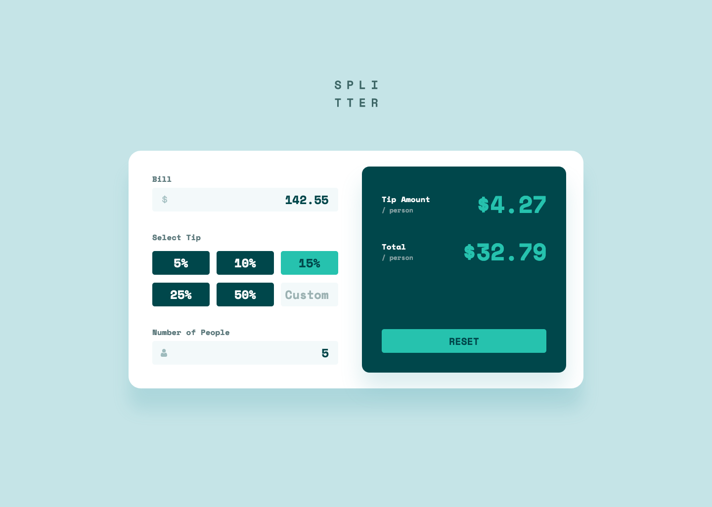

# Tip calculator app solution

This is a solution to the [Tip calculator app challenge on Frontend Mentor](https://www.frontendmentor.io/challenges/tip-calculator-app-ugJNGbJUX).

## Table of contents

-   [Links](#links)
-   [Built with](#built-with)
-   [What I learned](#what-i-learned)
-   [Author](#author)
-   [Screenshot](#screenshot)

## Links

-   [Solution URL](https://github.com/ionStici/tip-calculator-app-fem)
-   [Live Site URL](https://ionstici.github.io/tip-calculator-app-fem)

## Built with

-   Semantic HTML5 markup
-   CSS custom properties
-   Flexbox and CSS Grid
-   Mobile-first workflow

## What I learned

-   How to style the cursor with color
-   focusout js event

## Author

-   [GitHub](https://github.com/ionStici)
-   [Frontend Mentor](https://www.frontendmentor.io/profile/ionStici)
-   [Twitter](https://twitter.com/ionStici_)

## Screenshot

<!-- ### Primary

-   Strong cyan: hsl(172, 67%, 45%)

### Neutral

-   Very dark cyan: hsl(183, 100%, 15%)
-   Dark grayish cyan: hsl(186, 14%, 43%)
-   Grayish cyan: hsl(184, 14%, 56%)
-   Light grayish cyan: hsl(185, 41%, 84%)
-   Very light grayish cyan: hsl(189, 41%, 97%)
-   White: hsl(0, 0%, 100%)

### Body Copy

-   Font size (form inputs): 24px

### Font

-   Family: [Space Mono](https://fonts.google.com/specimen/Space+Mono)
-   Weights: 700 -->
